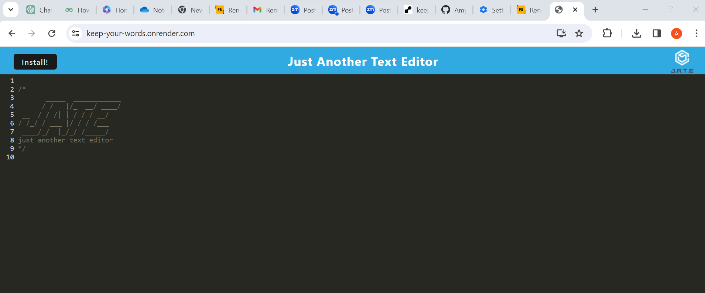

# Keep your words

## Description

JATE is a text editor. This text editor saves your words for the next time you want to get writing - whether online or offline. Saving offline is an important feature of an app for users who do not always have reliable internet. Perhaps you are remote or on a budget or only access the internet through wifi at your local library - you still deserve the capabilities of basic app like a text editor. 

Making the pre-made JATE app into a PWA app taught me how to strucutre my code in a new way through the client-server model. I was able to use a larger number of dev-dependencies to support my creation of this PWA. While using CRUD is a familiar concept, manipulating data in indexedDB was a new form of this.

## Table of Contents

- [Installation](#installation)
- [Usage](#usage)
- [Credits](#credits)
- [License](#license)

## Installation
Go to: https://keep-your-words.onrender.com/

Click the install button on the page or to the right in the address bar. 
JATE text editor is now downloaded and will work both on and offline.

## Usage

JATE app works in the browser:

And if you'd prefer to work offline, install JATE using the install button.

To use the text editor, simply click on the page and start typing. 

Feel free to stop and come back to your work later, as it will be saved in the JATE database ready for your return!

If you want to suggest additions or get in touch, go to:
https://github.com/AmyLloyd/keep-your-words 

## Credits

The code for the JATE text editor was supplied by the EdX Bootcamp team. 
The model for code was also supplied by EdX Bootcamp.

## License

No license.

## Features

IndexedDB functionality
PWA status
Installability
